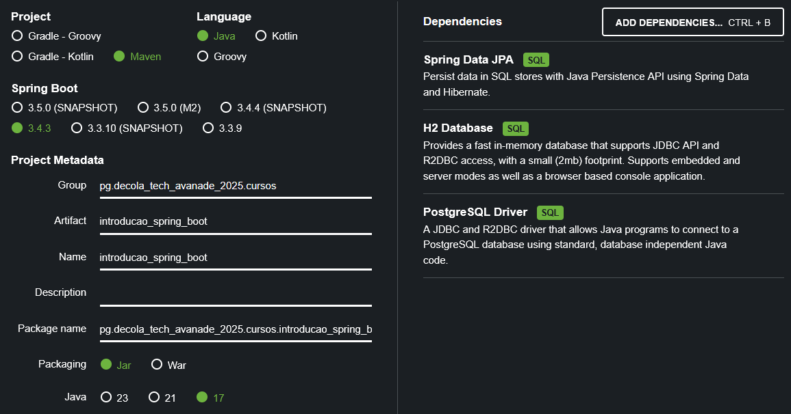

# Projeto de estudo, seguindo o conteúdo apresentado no curso 'Introdução a Spring Framework com Spring Boot'
O repositório contém, além das anotações nesse documento, um projeto Spring Boot desenvolvido seguindo o conteúdo apresentado na aula.
Caso haja divergência deixo claro, em comentários no código, o porquê de ter divergido da implementação demonstrada no curso.

## Setup
### Estrutura do projeto + dependências iniciais
O projeto foi estruturado da com ajuda da ferramenta [Spring Initializr](start.spring.io);
A seguinte configuração foi utilizada, incluindo dependências que, acredito, serão relevantes no curso.

## Padões, Conceitos Aplicados e Definições
- Sobre o Spring:
  - Framework para desenvolvimento de aplicações Java, fortemente relacionado aos padrões de Inversão de Controle e Injeção de Dependências.
    - Inversão de Controle (IoC) é um padrão que delega a responsabilidade sobre a criação e gerenciamento de objetos (controle) a um container, permitindo que o programa escrito concentre-se apenas no desenvolvimento de funcionalidade.
    - Injeção de Dependências (DI) é um padrão que, através do uso de interfaces comuns, permite que partes componentes de um sistema sejam 'injetadas' ou inseridas em momento de execução;
    Esse comportamento permite que hajam várias implementações diferentes para um determinado componente que realizem uma mesma função de uma maneira específica.
    Um exemplo relevante do uso de DI é em casos de teste onde precisamos acessar dados através de um repositório;
    Tendo uma interface definida para determinado repositório, posso ter uma implementação que acessa o banco de dados da aplicação e lida com dados reais enquanto outra, usada nos testes, acessa dados *in-memory*.
    - Oferece um ecosistema rico, com módulos para trabalhar com diversos contextos; Alguns exemplos são: Spring Web, Spring Security e o próprio Spring Boot.
- Beans: Objeto gerenciado pelo container Spring.
- Scopes; São:
  - Singleton: Como sugere o *design pattern*, um bean Singleton no Spring é uma instância única de sua classe, disponibilizada por toda a aplicação.
  - Prototype: Cada instância requisitada do container é uma instância nova.
  - Definidos como Web-Aware, esses escopos são aplicáveis no desenvolvimento de aplicações Web:
    - Request: A cada request HTTP, uma nova instância é fornecida; No processamento de uma mesma request, a instância devolvida na requisição do bean será a mesma (age como um "singleton temporário").
    - Session: Nesse escopo, uma única instância é fornecida por todo o escopo de uma sessão de usuário; Faz-se útil na gerência de estado durante uma sessão.
    - Global / Application: Fortemente ligado a um *ServletContext*, agindo de forma similar a um Singleton mas compartilhado para várias aplicações de um *ServletContext*.
- Annotations (Spring): Recursos usados no código para aplicar funcionalidades do Spring.
  - Fornecem recursos como o gerenciamento de escopo de um bean com `@Scope()` ou anotações especificas como `@RequestScope`.
  - Marcam beans como funcionalidades específicas a serem tratadas pelo Spring com `@Bean`, `@Controller`, etc.
  - Facilitam DI com `@Autowired`.
  - `@Component`: Define um componente básico. Funcionalidade inclusa em várias outas anotações.
  - Uso de `@Component` vs `@Bean`: Enquanto Components são Beans, a diferença no uso das anotações é quanto ao recurso sendo instanciado.
    - `@Component` é usado para recursos originais da aplicação, os quais o código-fonte é conhecido.
    - `@Bean` é usado para recursos de origem externa a aplicação, cujo código-fonte não é conhecido (como bibliotecas).
- Spring Boot: Facilita configuração do Spring, provendo defaults e tornando mais simples o desenvolvimento.
  - Starters: Conjuntos de dependências para casos de uso comuns.
- Interface `CommandLineRunner` define contrato para implementação de funcionalidade chamada no início da aplicação Spring.
Classes implementando essa interface, terão seu método 'run' chamado no início da aplicação.

## Referências
- [Baeldung - Quick Guide to Spring Bean Scopes](https://www.baeldung.com/spring-bean-scopes)